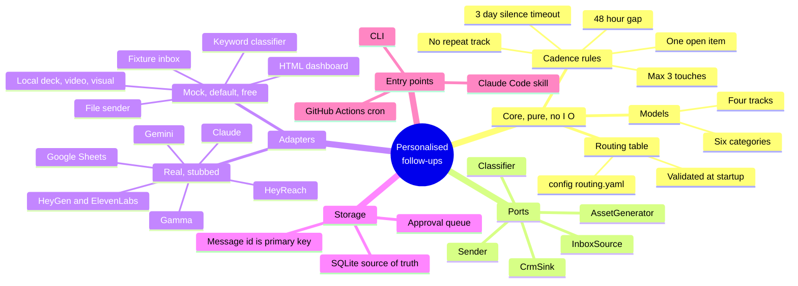
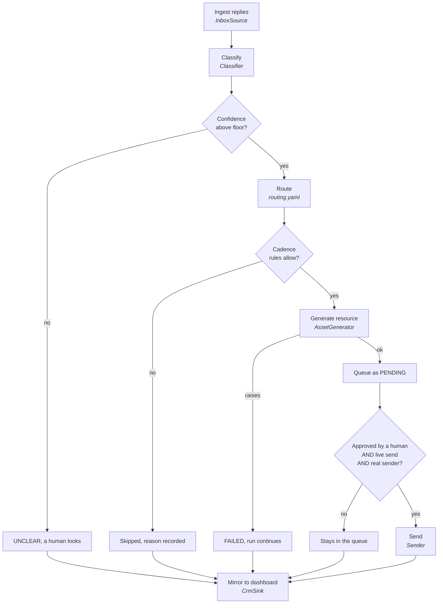
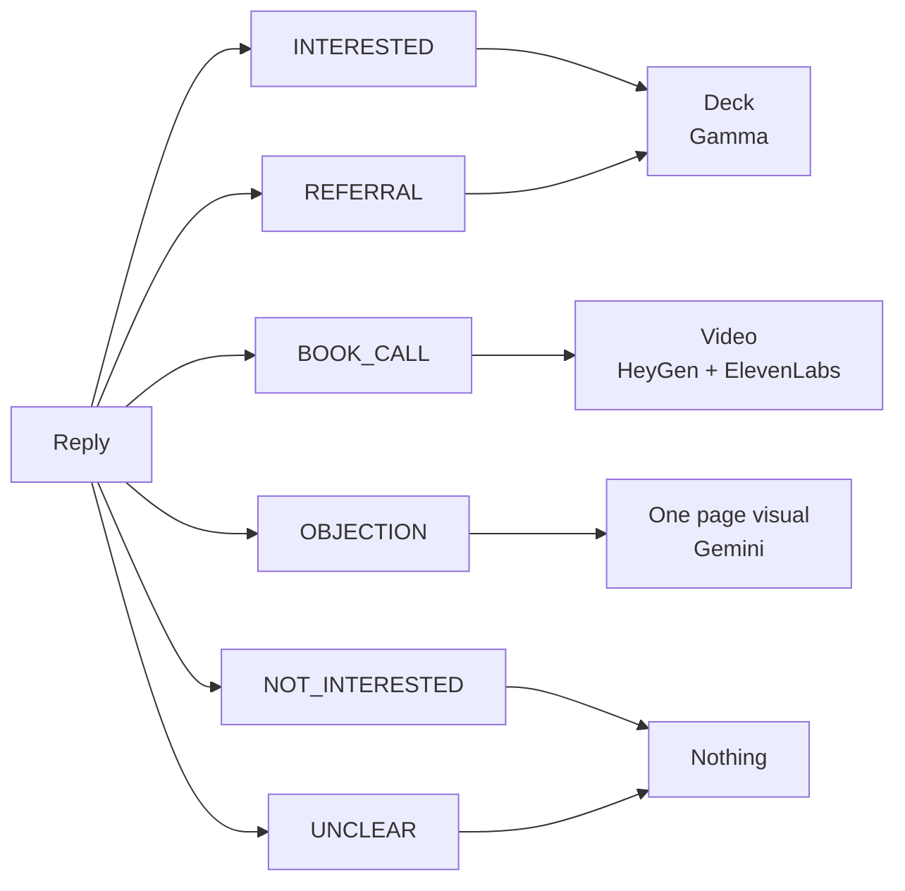

# Architecture mind map

## The system

```mermaid
mindmap
  root((Personalised<br/>follow-ups))
    Core, pure, no I O
      Models
        Six categories
        Four tracks
      Routing table
        config routing.yaml
        Validated at startup
      Cadence rules
        No repeat track
        48 hour gap
        3 day silence timeout
        Max 3 touches
        One open item
    Ports
      InboxSource
      Classifier
      AssetGenerator
      Sender
      CrmSink
    Adapters
      Mock, default, free
        Fixture inbox
        Keyword classifier
        Local deck, video, visual
        File sender
        HTML dashboard
      Real, stubbed
        HeyReach
        Claude
        Gamma
        HeyGen and ElevenLabs
        Gemini
        Google Sheets
    Storage
      SQLite source of truth
      Message id is primary key
      Approval queue
    Entry points
      CLI
      GitHub Actions cron
      Claude Code skill
```

## The daily run

```mermaid
flowchart TD
    A[Ingest replies<br/><i>InboxSource</i>] --> B[Classify<br/><i>Classifier</i>]
    B --> C{Confidence<br/>above floor?}
    C -- no --> X[UNCLEAR, a human looks]
    C -- yes --> D[Route<br/><i>routing.yaml</i>]
    D --> E{Cadence<br/>rules allow?}
    E -- no --> Y[Skipped, reason recorded]
    E -- yes --> F[Generate resource<br/><i>AssetGenerator</i>]
    F -- raises --> Z[FAILED, run continues]
    F -- ok --> G[Queue as PENDING]
    G --> H{Approved by a human<br/>AND live send<br/>AND real sender?}
    H -- no --> I[Stays in the queue]
    H -- yes --> J[Send<br/><i>Sender</i>]
    J --> K[Mirror to dashboard<br/><i>CrmSink</i>]
    I --> K
    Y --> K
    Z --> K
    X --> K
```

## Which reply gets which resource

```mermaid
flowchart LR
    R[Reply] --> I[INTERESTED] --> D[Deck<br/>Gamma]
    R --> B[BOOK_CALL] --> V[Video<br/>HeyGen + ElevenLabs]
    R --> O[OBJECTION] --> S[One page visual<br/>Gemini]
    R --> F[REFERRAL] --> D
    R --> N[NOT_INTERESTED] --> Q[Nothing]
    R --> U[UNCLEAR] --> Q
```
